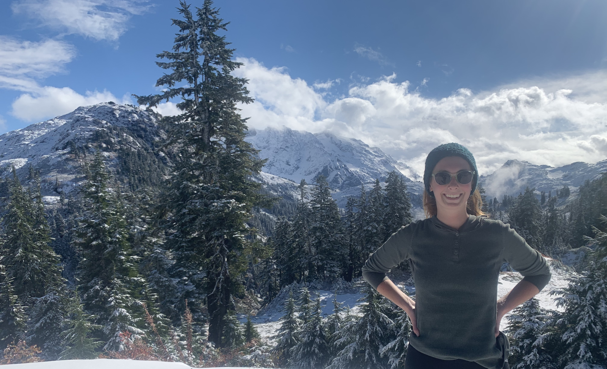

# Olana R. Costa #
Master's Candidate, Western Washington University, Bellingham, Washington
olanacosta@aol.com

## EDUCATION ##
Western Washington University 
Master of Science in Geophysics, Current, GPA 4.0

State University of New York at New Paltz 
Bachelor of Science in Geology, December 2020, GPA 3.8

Dutchess Community College
Associates of Arts, May 2017, GPA 3.6

## RESEARCH EXPERIENCE ##
Western Washington University Geology Department 
Under the advisement of Dr. Jackie Caplan-Auerbach
Working Thesis: “Investigating Kilauea’s 2018 Offshore Lava Emplacement Through Hydroacoustic Data”
•Analyzed hydroacoustic data via spectrograms and waveform objects through MATLAB.
•Modeled acoustic ray propagation and transmission loss using Bellhop.
•Ray path models will be used to determine offshore locations of lava-water interactions. 

## RELEVANT WORK EXPERIENCE ##                   
Western Washington University
Bellingham, WA
Present                 
Teaching Assistant (Physical Geology, Intro to Geophysics, Hydrogeology, Surface Water Hydrology, Engineering Geology, Stratigraphy and Sedimentology)
•Led undergraduate labs, giving a brief lecture at the start of each class and assisted the students through each assignment. 
•Graded assignments in a fair and timely manner.

C2G Environmental Consultants, LLC  
New Paltz, NY       
Winter 2020         
Geologist  
•Identified and located underground oil tanks using ground penetrating radar. 
•Collected and interpreted soil, water, and air samples.
•Led construction crews during the removal of underground oil tanks and the excavation of contaminated soil. 
•Developed reports for clients as well as the New York State Department of Environmental Conservation that described the scope and remediation methods of hazardous material spills. 
•Developed Phase I&II Environmental Site Assessments.
•Constructed site maps using AutoCAD.

Quality Environmental Solutions and Technologies Inc.                     Wappinger’s Falls, NY 
Summer 2020   
Field Technician
•Conducted hazardous material surveys in preparation of building renovation and demolition projects throughout New York State, which included sample collection, data interpretation, and reporting. 
•Interpreted air sample results to determine effectiveness of current work plans for maintaining 
clean air on work sites and provided solutions to contractors as necessary.
•Worked closely with management and supervisors from several cooperating agencies per project 
daily, ensuring a safe work environment and compliance with state and federal regulations.

SUNY Research Foundation 
New Paltz, NY         
Summer 2020      
Student Research Assistant 
•Described the present geomorphology using ground penetrating radar for commercial development.
•Identified possible locations of Native American artifacts using ground penetrating radar. These locations were later used by the team’s archeologists.  
•Collaborated with head geomorphologist to develop an official report for the landowner.

SUNY New Paltz Geology Department
New Paltz, NY       
Spring 2020     
Teaching Assistant (Geomorphology)
•Assisted the geomorphology instructor facilitate each lab by answering questions and describing concepts.

## OTHER RELEVANT EXPERIENCE ##
Waterfront Multichannel Analysis of Surface Waves (MASW) Project
Fall/Winter 2022
•Will implement MASW technique to produce a seismic hazard assessment of the Bellingham Waterfront. (Ongoing)  

Oral Presentation at American Geophysical Union (AGU) Annual Conference
Winter 2022
•Costa, O., Caplan-Auerbach, J., Atkins, Carmen “Investigating Kilauea’s 2018 Offshore Lava Emplacement Through Hydroacoustic Data” 2022 Fall Meeting, AGU.

Completed Course in Applied Geophysics
Spring 2022
•Deployed and operated geophysical survey methods including seismic refraction, ground penetrating radar, electrical resistivity, and magnetic and gravitational surveys.
•Analyzed and interpreted data to determine the subsurface layers (thickness and composition), P-wave velocity for the geological units, depth to bedrock, and the location of major subsurface utilities.
•Produced written reports for each geophysical survey performed and a final report that summarized and compared the results of each technique used and provided an overall site characterization with recommendations for further work. 

Completed IRIS 70-hour Seismology Skill Building Workshop
Summer 2021
•Learned introductory seismology concepts
•Developed beginner level fluency in Python3, Obspy, Shell Scripting, SAC, and GMT to analyze and plot seismic data.
•Gained beginner level experience working in Linux operating system, using webservices to request seismic data, and creating Jupyter Notebooks. 

Completed OSHA 10-Hour Construction Safety and Health Certification
Summer 2020

## ACADEMIC ACHIEVEMENTS ##
WWU Marine and Coastal Sciences (MACS) Graduate Student Summer Research Stipend
2022                    
Provided $4,000 for financial support while conducting summer research.

GSA Graduate Student Research Grant
2022                     
Provided $1,250 to be used toward research expenses.

Angelo Tagliacozzo Memorial Scholarship
2021                     
Provided $2,500 to be used toward graduate school expenses.
•Scholarship awarded for academic excellence in the American Institute of Professional Geologists (NE-AIPG).

Professor ‘Doc’ Rutstein Scholarship         
2020                     
Provided $2,000 to be used toward tuition costs.
•Scholarship awarded for academic excellence in the SUNY New Paltz Geology Department.

Milton Garrison Memorial Scholarship         
2020                     
Provided $1,000 to be used toward tuition costs.
•Scholarship awarded for academic excellence in the SUNY New Paltz Geology Department.

Induction into Sigma Gamma Epsilon 
2019
•A national honor society which recognizes academic scholarship in the earth sciences.

Conklin Scholarship         
2015-2017           
Provided the full cost of tuition to Dutchess Community College to earn an associate degree.
•Scholarship awarded to high school students with grades in the top 10% of their graduating class. 

## RELEVANT COMPUTER SKILLS ##
General:
•MATLAB
•ArcGIS Pro
•Illustrator/Inkscape
•Python3 
•Excel
Programs specific to subsurface imaging:
•Pickwin (Seismic Refraction)
•PlotRefa (Seismic Refraction)
•IP2 Win (Electrical Resistivity)
•Radan 7 (GPR)
•MagMap (Magnetometer survey)

## PERSONAL / VOLUNTEER WORK ##
Amphibian Migrations & Road Crossings Project 
•Identified and kept count of various migrating amphibians while assisting them across roadways.
Nooksack Salmon Enhancement Association
•Planted native trees and shrubs and removed invasive species along migratory waterways of salmon. 

